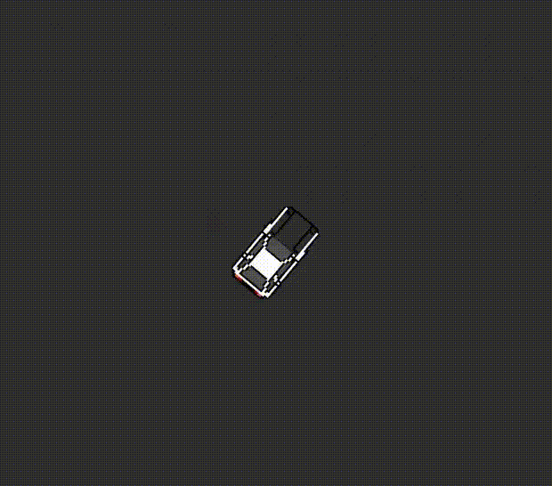
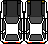

# General info

This project was inspired by the anime and video game series Initial D. It is a simple top-down viewing racing game
where the objective is to complete the track as soon as possible.

# Game mechanics
In classic Initial D fashion, the main mechanic of this game is, obviously, driving but more importantly
drifting. The mechanic is displayed in the GIF below.

# Cars
Currently, there is only one car available and that is the legendary Toyota AE68 Trueno. All sprites are made by me.

# Maps
New Akina track map is in progress, for now only a test circuit map exists.

## Platforms

- `core`: Main module with the application logic shared by all platforms.
- `lwjgl3`: Primary desktop platform using LWJGL3; was called 'desktop' in older docs.

## Gradle

This project uses [Gradle](https://gradle.org/) to manage dependencies.
The Gradle wrapper was included, so you can run Gradle tasks using `gradlew.bat` or `./gradlew` commands.
